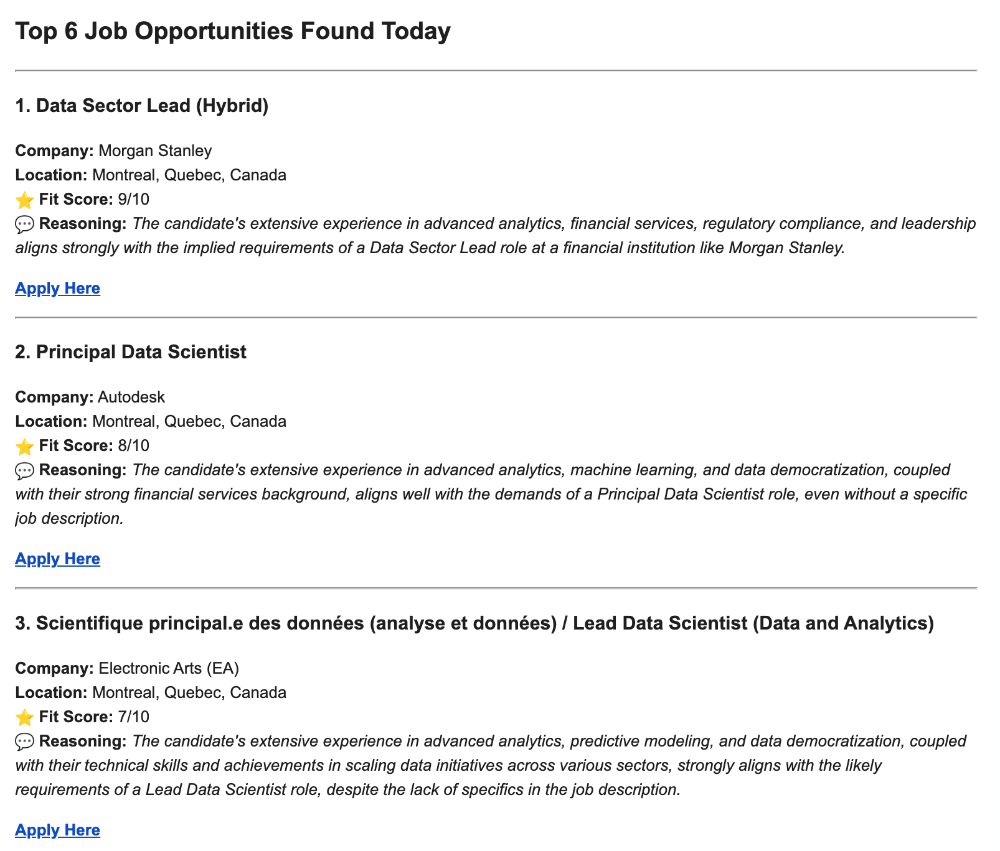

# Gemini Job Scout

An intelligent, automated **AI Agent** that scrapes job boards, scores opportunities against your resume using Gemini LLM, and delivers a personalized daily digest to your inbox. This project is designed to be deployed as a serverless function on Google Cloud.

## Key Features

*   **Automated Multi-Source Scraping:** Gathers job listings from multiple sites (like LinkedIn and Indeed) by iterating through a list of custom keywords and locations.
*   **Intelligent AI Scoring:** Uses the Google Gemini API to analyze each job description against your personal resume, providing a "Fit Score" and a concise reasoning for its recommendation.
*   **Multi-Stage Filtering Pipeline:** Employs a robust, multi-step process to refine search results:
    1.  **Location Filter:** Ensures results are geographically relevant, correctly handling local and national remote roles.
    2.  **Date Filter:** Keeps only recent job postings.
    3.  **Keyword Shield:** Uses topic and seniority keywords to discard irrelevant jobs *before* the expensive AI analysis step.
*   **Daily Email Digest:** Delivers a clean, easy-to-read HTML report of the top-scoring job opportunities directly to your email every morning.
*   **Serverless & Automated:** Designed to be deployed on Google Cloud Functions and triggered automatically by Cloud Scheduler, creating a true "set it and forget it" agent.

## How It Works

The agent operates as a multi-stage funnel to find the best jobs for you:

1.  **Scrape:** The script initiates multiple, simple searches for each keyword (e.g., "Data Science", "Analytics") in each location (e.g., "Montreal QC", "Canada") to cast the widest possible net.
2.  **Consolidate:** All results are combined into a single list, and duplicate job postings are removed.
3.  **Filter:** The consolidated list is passed through a series of precise filters (Location, Date, and Keywords) to remove the vast majority of irrelevant roles.
4.  **Analyze & Score:** Each job that survives the filtering process is sent to the Google Gemini API, along with your resume. The AI returns a score from 1-10 and a summary.
5.  **Report:** The highest-scoring jobs (above a set threshold) are formatted into an HTML email and sent to your inbox.

## Technology Stack

*   **Language:** Python
*   **Core AI:** Google Gemini API (`gemini-1.5-flash-latest`)
*   **Web Scraping:** `python-jobspy`
*   **Data Handling:** `pandas`
*   **Deployment:** Google Cloud Functions (1st Gen)
*   **Scheduling:** Google Cloud Scheduler (using Pub/Sub)
*   **Secrets Management:** Google Secret Manager

## Setup and Deployment Guide

Follow these steps to deploy your own personal job scout.

### 1. Project Files

Create a local folder and place the following three files inside it:

*   **`main.py`**: The core Python script for the agent.
*   **`requirements.txt`**: A list of Python libraries needed for the project.
*   **`resume.txt`**: A plain text file containing the full text of your resume.

### 2. Get a Gmail App Password

Your agent needs a secure way to send emails.
1.  Go to your Google Account and ensure **2-Step Verification** is enabled under the **Security** tab.
2.  On the Security page, go to **App passwords**.
3.  Select `Mail` for the app and `Other (Custom name)` for the device.
4.  Name it "Cloud Job Agent" and click **Generate**.
5.  **Copy the 16-character password.** This is your `GMAIL_APP_PASSWORD`.

### 3. Google Cloud Project Setup

1.  **Create a Project:** Go to the [Google Cloud Console](https://console.cloud.google.com/) and create a new project.
2.  **Enable APIs:** In the search bar, find and **ENABLE** the following four APIs:
    *   `Cloud Functions API`
    *   `Cloud Build API`
    *   `Cloud Scheduler API`
    *   `Secret Manager API`
3.  **Store Secrets:** Go to **Secret Manager** and create the following four secrets:
    *   `GOOGLE_API_KEY`: Your Google AI API key.
    *   `SENDER_EMAIL`: Your full Gmail address.
    *   `RECEIVER_EMAIL`: The email address where you want to receive the digest.
    *   `GMAIL_APP_PASSWORD`: The 16-character password you generated above.

### 4. Deploy the Cloud Function (1st Gen)

1.  **Prepare Code:** Create a `.zip` file of your project folder containing the three files.
2.  **Create a Storage Bucket:** Go to **Cloud Storage**, create a new bucket, and upload your `.zip` file to it.
3.  **Create the Function:**
    *   Go to **Cloud Functions** and click **Create Function**.
    *   **Environment:** `1st gen`
    *   **Function name:** `job-research-agent`
    *   **Region:** Choose a region (e.g., `northamerica-northeast1`).
    *   **Trigger type:** `Cloud Pub/Sub`. Click **Create a topic** and name it `daily-job-search-trigger`.
    *   **Memory allocated:** Set to **1 GiB**.
    *   **Timeout:** Set to **900** seconds.
    *   **Environment variables:** Add your four secrets as environment variables. It's recommended to link them from Secret Manager if the option is available, otherwise paste them directly for a quicker setup.
    *   Click **Next**.
    *   **Source Code:** Select `Cloud Storage ZIP file`, browse to your bucket, and select your uploaded `.zip` file.
    *   **Entry point:** `run_job_search`
    *   Click **Deploy**.

### 5. Schedule the Job

1.  Go to **Cloud Scheduler** and click **Create Job**.
2.  **Name:** `run-daily-job-search`
3.  **Frequency:** For 8 AM on weekdays, use the cron string `0 8 * * 1-5`.
4.  **Timezone:** Select your local timezone.
5.  **Target type:** `Pub/Sub`.
6.  **Topic:** Select the `daily-job-search-trigger` topic.
7.  Click **Create**.

Your agent is now fully deployed and will run on the schedule you set!

## Future Improvements

*   **Expand Job Boards:** Add more scrapers as they become reliable in `python-jobspy`.
*   **Advanced Filtering:** Implement a company name blocklist or filter by industry.
*   **Database Integration:** Store results in a database like Firestore or BigQuery to track jobs you've seen or applied for.
*   **Web Interface:** Create a simple front-end with a tool like Streamlit to view results and manage settings.

## License

This project is licensed under the MIT License.
